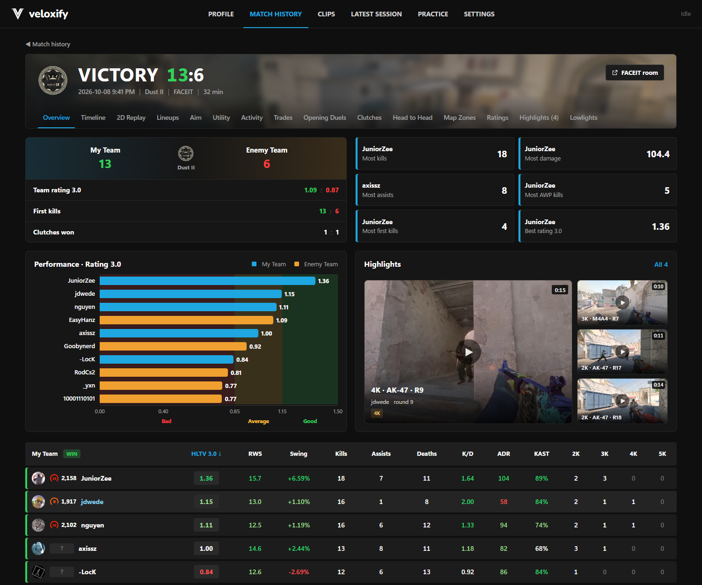
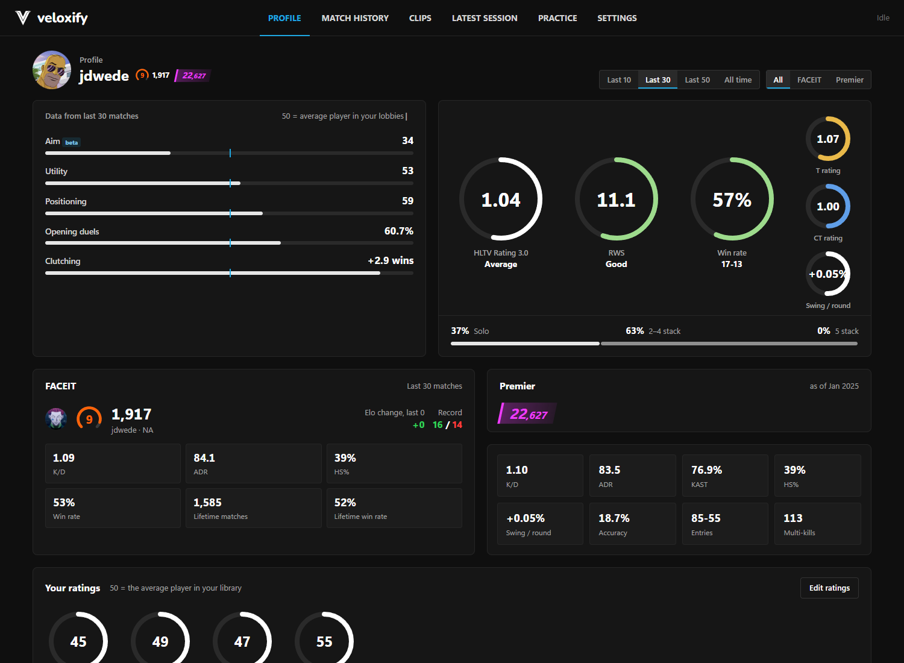
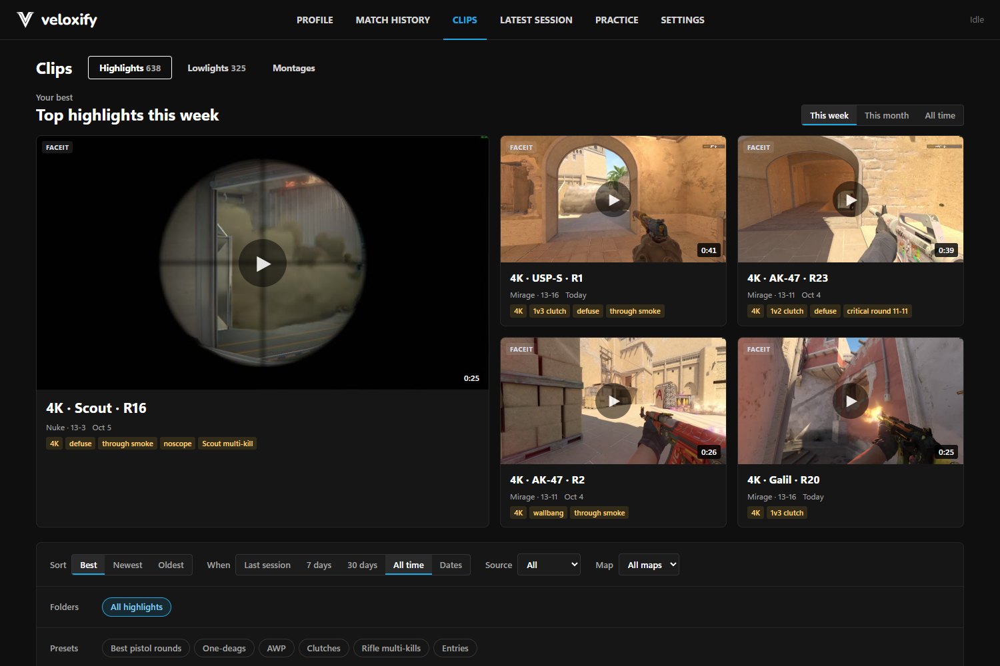
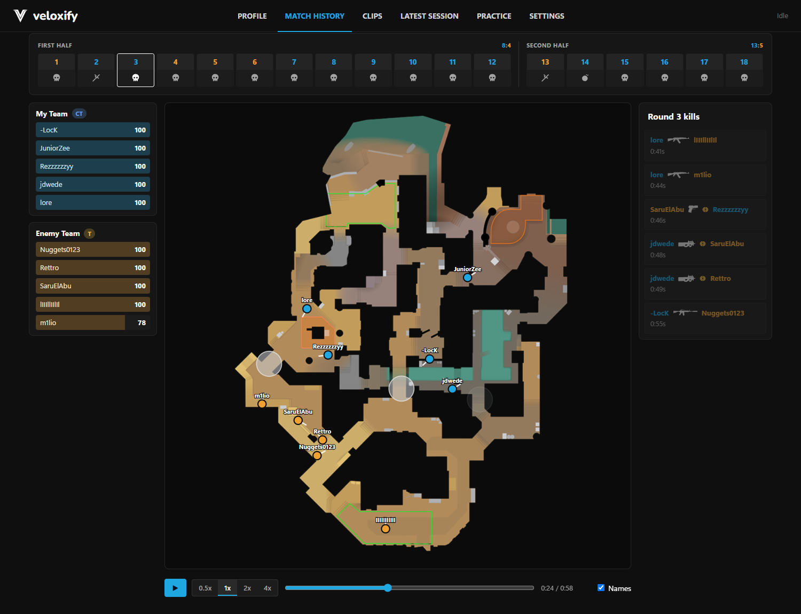
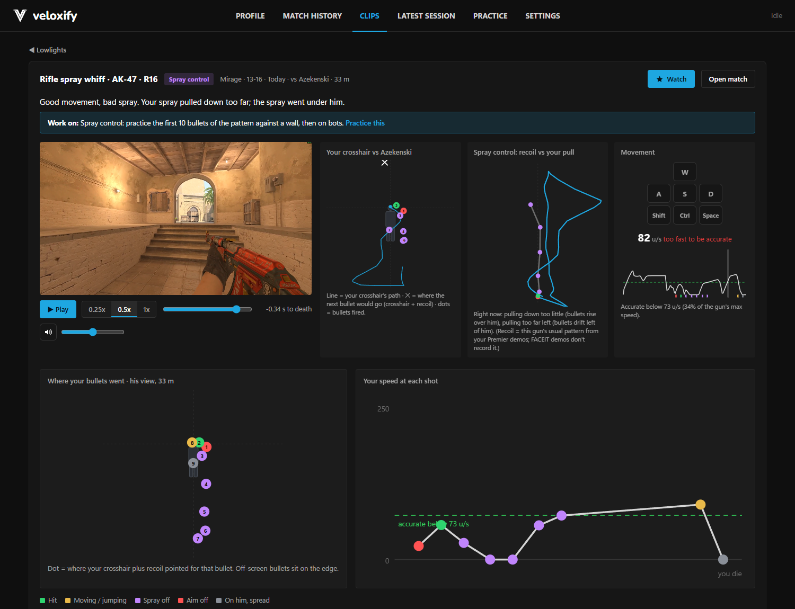
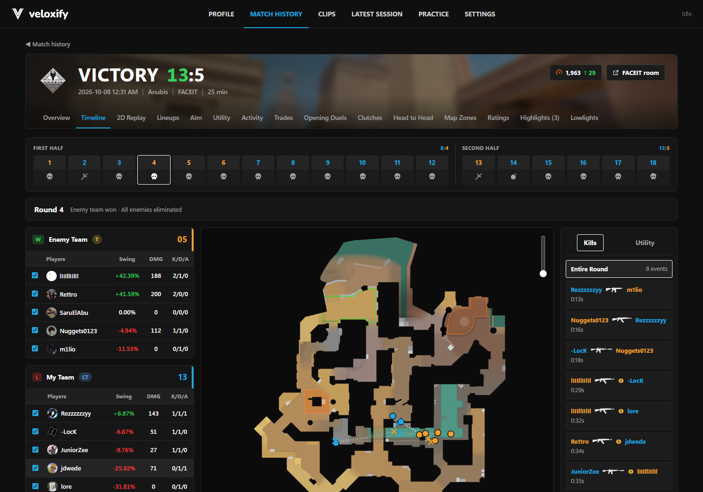
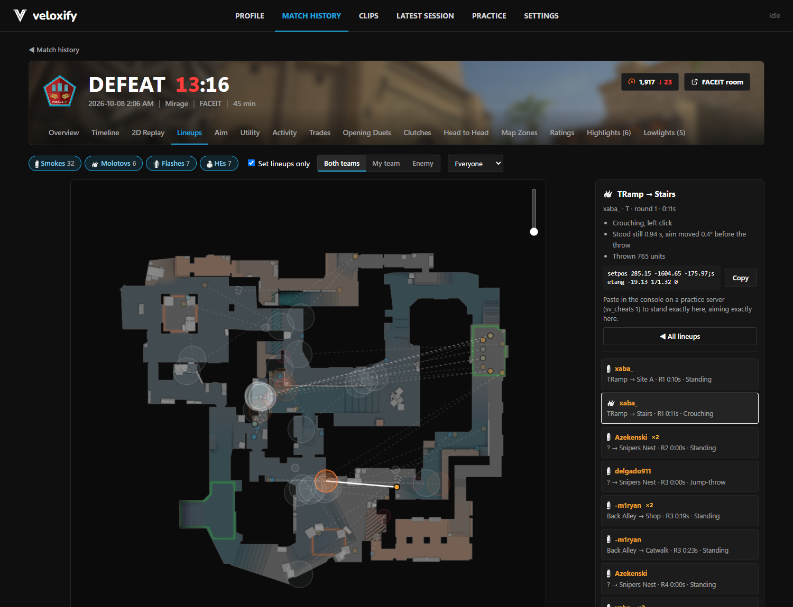
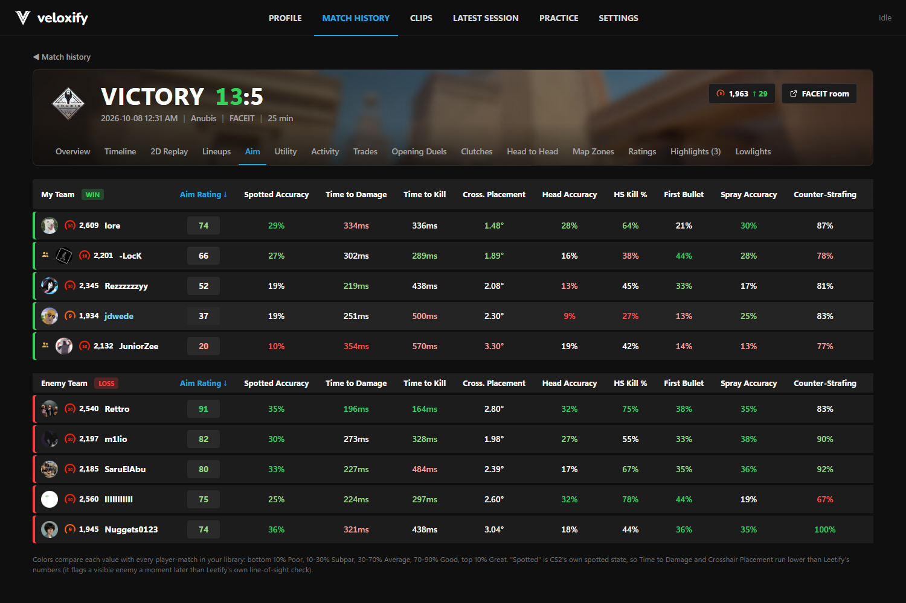
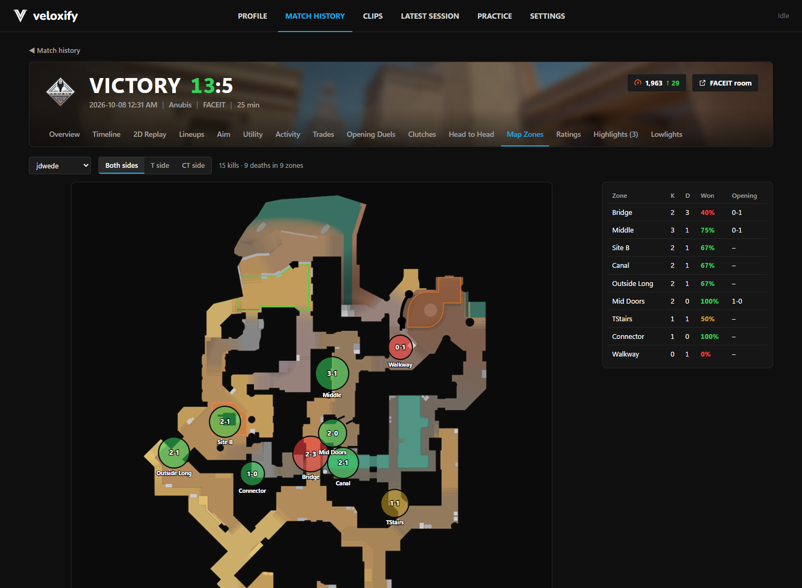
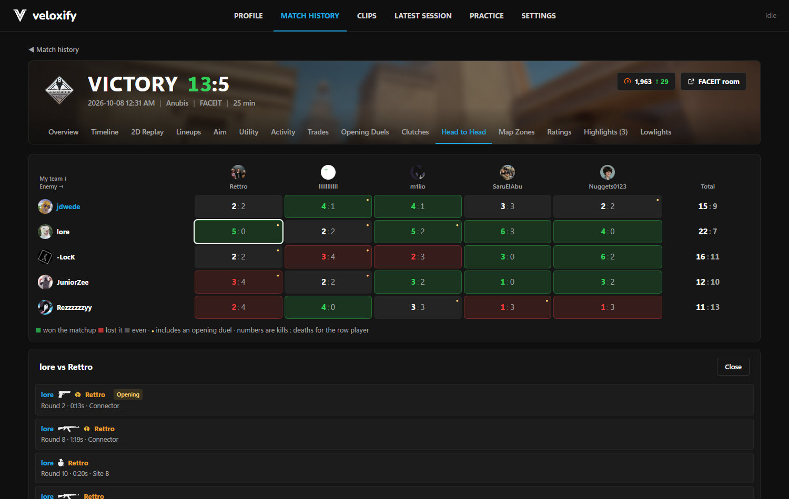

<div align="center">

# Veloxify

**Your CS2 highlights, stats and coaching, made on your own PC. Free.**

Veloxify watches for your FACEIT and Premier matches, records your best plays as clean clips,
breaks down your worst deaths, and gives you Leetify-style match pages: aim, utility, trades,
2D replays, grenade lineups and HLTV Rating 3.0. No subscription, no cloud, no watermark.



</div>

---

## Why Veloxify

Most of what makes CS2 stats and clip tools worth paying for runs fine on your own computer:
your demos are already there, and so is CS2. Veloxify uses them, so features that are paid
elsewhere are free here, with no monthly clip caps.

| What you get | Elsewhere it's paid | Veloxify |
|---|---|---|
| Auto highlight clips from **every** match, no clip limit | Allstar's free plan is 5 clips a month; auto-capture of every match is a paid plan. FACEIT's highlights need FACEIT Premium. | ✅ Free, unlimited |
| No watermark, up to 1440p / 60 fps | Allstar removes the watermark on paid plans only | ✅ Free |
| 2D round replays | Leetify: "2D Replay is only available to Leetify Pro users" | ✅ Free, every round |
| Highlights of your matches | Leetify Pro / FACEIT Premium | ✅ Free |
| Benchmarks against other players | Leetify Pro (pro-player benchmarks) | ✅ Free, against every player in your own matches |
| Advanced aim, utility, trade and clutch stats | Partly behind Leetify Pro / FACEIT Premium | ✅ Free |
| Whiff analyzer: *why* you lost a duel (spray, movement, crosshair) | Not offered | ✅ |
| Grenade lineups pulled from your matches, with `setpos` | Not offered | ✅ |
| Your data stays on your PC | Uploaded to their servers | ✅ Nothing leaves your machine |

<sub>Compared with what these services listed in October 2026. Veloxify isn't affiliated with Leetify,
FACEIT, Allstar or Valve.</sub>

## Features

**Highlights**
- Finds your best rounds in every demo: aces, 4Ks, 3Ks, clutches, entry kills, wallbangs, noscopes, smoke kills, flicks.
- Fair 2Ks count, eco-round kills are tagged "vs eco" so they don't drown out real plays.
- Renders them from the demo in CS2 itself, always from **your** view, with the clean kill-feed-only HUD.
- Runs after you close CS2: CS2 opens hidden, records, and puts your settings back. It stops the moment you open CS2 or FACEIT finds you a match.
- Clips page with "top this week", folders, presets (best pistol rounds, AWP, clutches...), montages.
- Hover a highlight to preview it, like a YouTube thumbnail.

**Lowlights and the whiff analyzer**
- Your deaths right after a miss, ranked by how much they cost.
- For each one: your crosshair against his body, your spray against the gun's real recoil pattern, the keys you pressed and your speed at every shot, in slow motion next to the clip.
- Tells you what went wrong ("counter-strafe 200 ms late", "pulled down too far") and what to practice.

**Match page** (every match, for all 10 players)
- Overview: HLTV Rating 3.0, Round Swing, RWS, KAST, ADR, HLTV-style summary and top highlights.
- Timeline: every round on the radar, kill by kill, with each player's swing.
- 2D Replay: whole rounds on the map with positions, view direction, HP, grenades and the bomb.
- Lineups: set smokes, molotovs and flashes, how they were thrown (jump-throw, crouch, left/right click) and a `setpos` to practice them.
- Aim: time to damage, crosshair placement, head accuracy, first-bullet and spray accuracy, counter-strafing.
- Utility, Activity, Trades, Opening Duels, Clutches, Head to Head, Map Zones.
- Every stat colored Poor to Great against every player-match in your library.

**Profile and progress**
- Your ratings over the last 10, 30, 50 games or all time; FACEIT and Premier side by side.
- FACEIT ELO graph, one dot per game, and monthly rating trends.
- Build your own ratings: pick stats, weight them, group them (an "Aim" or "Movement" rating your way).

**Demos**
- Premier: download the match in CS2 and Veloxify picks it up.
- FACEIT: one click downloads every missing demo through Veloxify's own FACEIT window. No API key; you sign in to FACEIT once, Veloxify never sees your password.
- ESEA league matches work too, including split demos after a server change.

## Screenshots

| | |
|---|---|
|  |  |
| **Profile**: ratings and FACEIT / Premier side by side | **Clips**: your best highlights |
|  |  |
| **2D Replay**: any round, on the map | **Whiff analyzer**: why you lost the duel |
|  |  |
| **Timeline**: every kill, with round swing | **Lineups**: set grenades from the match |
|  |  |
| **Aim**: Leetify-style aim stats with benchmarks | **Map Zones**: where you win and lose fights |
|  | |
| **Head to Head**: every matchup in the game | |

## Install

1. Download `Veloxify_x.y.z_x64-setup.exe` from [Releases](../../releases).
2. Windows may say "Windows protected your PC" (the app isn't code-signed): **More info → Run anyway**.
3. Stay logged in to Steam. Veloxify finds your Steam and FACEIT accounts by itself.

Needs Windows 10/11 (64-bit) and CS2 installed through Steam.

## How it works

- **Demos** are parsed locally with a vendored, pinned [demoparser](third_party/demoparser) (MIT).
- **Clips** are recorded from CS2's own demo playback: CS2 runs hidden, Veloxify drives it over the console, captures the window with Windows Graphics Capture and encodes with NVENC (or x264). Your video settings are swapped for the render and always restored.
- **Stats** follow HLTV's Rating 3.0 and Round Swing, and Leetify's published definitions for aim and utility.
- **Nothing is uploaded.** Steam and FACEIT are only asked for public match info and avatars.

## Build from source

```
cargo build --release -p veloxify          # the app
cd app/src-tauri && cargo tauri build      # the installer (bundles ffmpeg; see resources/ffmpeg/README.txt)
```

Layout:
- `app/` — the Veloxify desktop app (Tauri 2): `src-tauri/` (Rust) and `ui/` (HTML/JS/CSS).
- `crates/core` — demo loading, match model, stats, highlights, lowlights, match-page details.
- `crates/render` — rendering clips with CS2 (console control, settings protection, assembly).
- `crates/capture` — window and per-process audio capture, hardware H.264.
- `crates/cli` — `cs2hl` developer CLI (`analyze`, `validate`, `events`, `library`, `render`).
- `third_party/demoparser` — vendored CS2 demo parser (MIT, see `VENDORED.md`).
